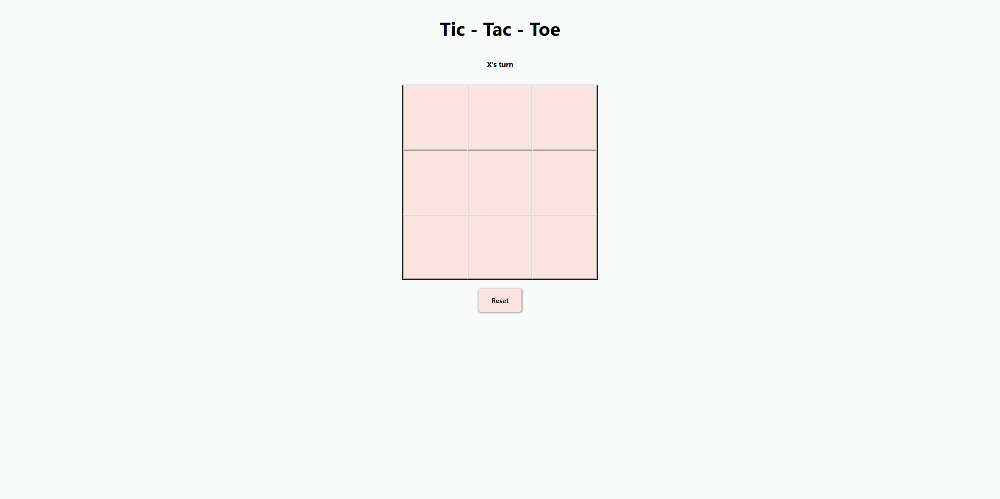

## Table of Contents

1. [Description](#description)
1. [Demo](#demo)
1. [Design](#design)
1. [Features](#features)
1. [Technologies Used](#technologies-used)
1. [Project Challenges](#project-challenges)
1. [Thoughts and Observations](#thoughts-and-observations)
1. [Future Enhancements](#future-enhancements)
1. [Installation](#installation)

## Description

Tic-Tac-Toe is a classic 3x3 grid game where two players take turns placing "X" and "O" on the board. The goal is to get three of your marks in a row, column, or diagonal. This project is a web-based implementation using HTML, CSS, and JavaScript. The application supports:

Two-player gameplay
Interactive gameboard
Automatic win detection
Restart functionality
The project provides a smooth user experience, ensuring that players can easily track turns, and the game can be reset at any time.

## Demo

You can see a live demo of the project here:

Click here: [https://link-to-your-demo-goes-here/](https://link-to-your-demo-goes-here/)

## Design

Add a screenshot or video here. 
I recommend https://shots.so

<div align='center'>


</div>

## Features

- Interactive Gameboard: A grid of buttons where players can click to place their marks.
- Win Condition Detection: Automatically checks if a player has won via rows, columns, or diagonals.
- Tie Detection: If all cells are filled and no player has won, the game ends in a tie.
- Player Turn Management: Players alternate turns, and the game indicates which player's turn it is.
- Reset Functionality: The game can be restarted with a reset button.

## Technologies Used

- HTML5: Markup language used for the basic structure of the page.
- CSS3: Styles to make the game visually appealing and responsive.
- JavaScript: Logic to manage the game’s functionality, including the game state, player switching, and win  detection.

## Project Challenges

During development, a few challenges were encountered, including:

One of the key design patterns used in this project was factory functions and encapsulation. This introduced a few challenges during development:

1. Factory Functions for Player and Cell Objects:
At the heart of the project is the use of factory functions to create player and cell objects. This was a deliberate choice to avoid the complexity of using classes, while still providing a clean and modular approach to object creation.

- The player factory creates player objects with two properties: name and value, and the cell factory creates cells with methods to set and get their values. These factories encapsulate the logic for managing each entity's state, preventing any unwanted external modification of their internal data.
- A challenge here was ensuring that each player and cell was isolated and independent from others, meaning their states couldn't be shared or mutated unintentionally. This was important for maintaining a clean game state, especially when handling multiple players.
Encapsulation:
Each player and cell function provides encapsulation by hiding their internal state and only exposing methods to interact with it. For example, the cell object has an addValue method to set its value and a getValue method to retrieve it, while the player factory manages only the player's name and token. By encapsulating this logic, the game logic remains clean and avoids accidental interference with the internal state of these entities.

2. Managing State with Encapsulation:
While encapsulation ensures that the state of each player and cell is protected, it also made it a bit tricky to manage the game's state transitions. Specifically, ensuring that when a player clicks on a cell, the cell's state (its value) is properly updated without exposing direct access to the cell’s internal workings required careful use of methods and properties.

3. Overcoming these challenges required designing clear and distinct interfaces for the game entities (player and cell) and making sure that each component could be easily updated and interacted with through well-defined methods.

## Thoughts and Observations

This project helped me gain a better understanding of how to structure a simple game with JavaScript. The use of pure JavaScript (without any libraries) was intentional to focus on the logic and DOM manipulation. The use of factory functions and encapsulation made the project both more flexible and maintainable and were the tools I really wanted to get comfortable and practice with this project. 

1. Encapsulation and State Management:
Encapsulation ensured that the internal state of players and cells couldn’t be directly modified from outside their respective functions. This made it easier to control how the game progresses because the state changes were only allowed through the provided methods (addValue for cells and accessing player tokens via value), ensuring that game rules are respected. By isolating the internal logic of each object, I was able to better manage the game's rules, such as preventing players from overwriting a cell that's already occupied.

2. Simplified Debugging:
The encapsulation and factory function pattern made it easier to debug the application. If there was an issue with player switching or cell updates, I knew exactly where to look because each player and cell object was self-contained. For example, if a cell wasn't updating correctly, I could focus on the addValue or getValue methods of the cell factory, without worrying about unintended side effects elsewhere in the code.

## Future Enhancements

- AI Opponent: Implementing a basic AI player that can play against a human.
- Extended Board Sizes: Allow users to choose different board sizes, such as 4x4 or 5x5 grids.
- User Profiles: Add a system where players can set their names and track game stats.
- Improved UI: Adding animations and sound effects to enhance the user experience.


## Installation

Provide instructions on how to install and run your project locally.

Example below:

1. Clone the GitHub repository to your local machine:

   ```bash
   git clone https://github.com/your-username/tic-tac-toe.git
   ```

2. Navigate to the project's directory:

   ```bash
   cd tic-tac-toe
   ```
3. Open the index.html file in your browser to play the game!

   ```bash
   open index.html
   ```

No additional setup is required, as the project only relies on the basic functionality provided by the browser.